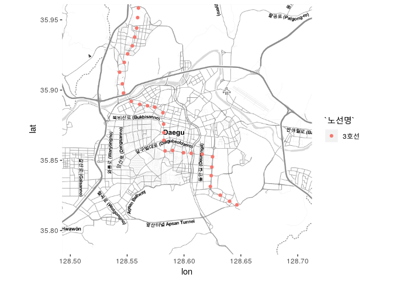

'ggmap'을 이용해서 대구 메트로 시각화하기 - 2일차
================

-   [함께 보기](#함께-보기)
-   [목적](#목적)
-   [필요한 패키지](#필요한-패키지)
-   [데이터](#데이터)
    -   [전국도시철도역사정보표준데이터.csv ("df\_역"이라 명명)](#전국도시철도역사정보표준데이터.csv-df_역이라-명명)
    -   [대구도시철도공사\_일별시간별승하차인원\_20171231.csv ("df\_승하차인원"이라 명명)](#대구도시철도공사_일별시간별승하차인원_20171231.csv-df_승하차인원이라-명명)
-   [데이터 전처리](#데이터-전처리)
    -   [df\_역에서 대구 메트로 정보만 가져오기.](#df_역에서-대구-메트로-정보만-가져오기.)
        -   [대구 지도에 지하철역 뿌려보기](#대구-지도에-지하철역-뿌려보기)
    -   [df\_승차자인원을 조금 더 다루기 쉬운 형태로 정리하기.](#df_승차자인원을-조금-더-다루기-쉬운-형태로-정리하기.)
    -   [가공한 데이터 2개 (`df_대구메트로역`, `df_승하차_melted`)를 합치자.](#가공한-데이터-2개-df_대구메트로역-df_승하차_melted를-합치자.)
    -   [환승역 합치기](#환승역-합치기)
        -   [합치기 전에 살펴보기](#합치기-전에-살펴보기)
        -   [반월당역](#반월당역)
        -   [신남역](#신남역)
        -   [다시 합치기](#다시-합치기)
-   [지도에 뿌리기](#지도에-뿌리기)
    -   [2017년 12월 24일 오후 6시에서 7시 이용현황 (다시 그리기)](#년-12월-24일-오후-6시에서-7시-이용현황-다시-그리기)
    -   [2017년 요일별 이용현황](#년-요일별-이용현황)
    -   [2017년 시간대별 이용현황 (아침, 점심, 저녁)](#년-시간대별-이용현황-아침-점심-저녁)
-   [정리, 반성 및 Future work](#정리-반성-및-future-work)

함께 보기
=========

-   'ggmap'을 이용해서 대구 메트로 시각화하기 - 1일차
    -   <https://deepstat.tistory.com/96>

목적
====

-   대구 메트로 상하차 정보가 인터넷에 공개되어있는데, 이를 기반으로 지도에 시각화해보면, 어떤 통찰(인사이트)를 얻을 수 있지 않을까 하는 생각이 들어서 해보게 되었다.

-   메트로, 시내버스, 택시정보 등등을 하나하나 시각화하고 이를 종합할 수 있다면, 대구 교통량이 어떤지 뿐만 아니라, 더 나아가서,
    -   대구 대중교통체계가 잘 작동하고 있는지,
    -   어떤 곳이 교통 취약지역인지,
    -   어떤 곳이 교통이 좋은지,
    -   어떻게 보강하는게 좋을 것인지 등을 고민할 수 있는 여지가 생긴다고 생각한다.
-   혹은 부동산?

-   혹은 정책평가?

필요한 패키지
=============

-   `tidyverse`, `reshape2`, `ggmap`

``` r
library(tidyverse)
```

    ## ─ Attaching packages ──────────────────────────────── tidyverse 1.2.1 ─

    ## ✔ ggplot2 3.1.0     ✔ purrr   0.2.5
    ## ✔ tibble  1.4.2     ✔ dplyr   0.7.7
    ## ✔ tidyr   0.8.2     ✔ stringr 1.3.1
    ## ✔ readr   1.1.1     ✔ forcats 0.3.0

    ## ─ Conflicts ───────────────────────────────── tidyverse_conflicts() ─
    ## ✖ dplyr::filter() masks stats::filter()
    ## ✖ dplyr::lag()    masks stats::lag()

``` r
library(reshape2)
```

    ## 
    ## Attaching package: 'reshape2'

    ## The following object is masked from 'package:tidyr':
    ## 
    ##     smiths

``` r
library(ggmap)
```

데이터
======

전국도시철도역사정보표준데이터.csv ("df\_역"이라 명명)
------------------------------------------------------

-   출처 : <https://www.data.go.kr/dataset/15013205/standard.do>

``` r
df_역 <- read.csv("../Original_Data/전국도시철도역사정보표준데이터.csv", fileEncoding = "CP949")
```

대구도시철도공사\_일별시간별승하차인원\_20171231.csv ("df\_승하차인원"이라 명명)
--------------------------------------------------------------------------------

-   출처 : <https://www.data.go.kr/dataset/15002503/fileData.do>

``` r
df_승하차인원 <- read.csv("../Original_Data/대구도시철도공사_일별시간별승하차인원_20171231.csv", fileEncoding = "CP949")
```

데이터 전처리
=============

df\_역에서 대구 메트로 정보만 가져오기.
---------------------------------------

``` r
df_대구메트로역 <- df_역 %>%
  select(., 노선명, 역번호, 역사명, 역위도, 역경도) %>% # 남길 열 선택
  filter(., substr(노선명,1,2) == "대구") %>% # $노선명 의 앞 2자리가 대구면 선택한다.
  mutate(., 노선명 = substr(노선명,9,11)) # 노선명을 정리
```

### 대구 지도에 지하철역 뿌려보기

-   대구 지도 가져오기

``` r
대구지도 <- get_map(c(lon=128.60250, lat=35.87222), zoom=12, maptype="toner-lite")
```

    ## maptype = "toner-lite" is only available with source = "stamen".

    ## resetting to source = "stamen"...

    ## Map from URL : http://maps.googleapis.com/maps/api/staticmap?center=35.87222,128.6025&zoom=12&size=640x640&scale=2&maptype=terrain&sensor=false

    ## Map from URL : http://tile.stamen.com/toner-lite/12/3509/1608.png

    ## Map from URL : http://tile.stamen.com/toner-lite/12/3510/1608.png

    ## Map from URL : http://tile.stamen.com/toner-lite/12/3511/1608.png

    ## Map from URL : http://tile.stamen.com/toner-lite/12/3512/1608.png

    ## Map from URL : http://tile.stamen.com/toner-lite/12/3509/1609.png

    ## Map from URL : http://tile.stamen.com/toner-lite/12/3510/1609.png

    ## Map from URL : http://tile.stamen.com/toner-lite/12/3511/1609.png

    ## Map from URL : http://tile.stamen.com/toner-lite/12/3512/1609.png

    ## Map from URL : http://tile.stamen.com/toner-lite/12/3509/1610.png

    ## Map from URL : http://tile.stamen.com/toner-lite/12/3510/1610.png

    ## Map from URL : http://tile.stamen.com/toner-lite/12/3511/1610.png

    ## Map from URL : http://tile.stamen.com/toner-lite/12/3512/1610.png

    ## Map from URL : http://tile.stamen.com/toner-lite/12/3509/1611.png

    ## Map from URL : http://tile.stamen.com/toner-lite/12/3510/1611.png

    ## Map from URL : http://tile.stamen.com/toner-lite/12/3511/1611.png

    ## Map from URL : http://tile.stamen.com/toner-lite/12/3512/1611.png

-   1호선만

``` r
ggmap(대구지도) + geom_point(data=df_대구메트로역 %>% filter(노선명 == "1호선"), aes(역경도, 역위도, colour = 노선명))
```

    ## Warning: Removed 5 rows containing missing values (geom_point).


-   1호선 자료가 좀 이상한 것 같다. `명덕역`, `대구역`과 `칠성시장역` 언뜻 보기에 왼쪽으로 약간 shift 된 것 같다.

-   2호선만

``` r
ggmap(대구지도) + geom_point(data=df_대구메트로역 %>% filter(노선명 == "2호선"), aes(역경도, 역위도, colour = 노선명))
```

    ## Warning: Removed 9 rows containing missing values (geom_point).


-   3호선만

``` r
ggmap(대구지도) + geom_point(data=df_대구메트로역 %>% filter(노선명 == "3호선"), aes(역경도, 역위도, colour = 노선명))
```



df\_승차자인원을 조금 더 다루기 쉬운 형태로 정리하기.
-----------------------------------------------------

``` r
df_승하차_melted <- df_승하차인원 %>%
  select(., -일계) %>% # 1. $일계 제거
  melt(.,id.vars = c("월", "일", "역번호", "역명", "승하"),
       variable.name = "시간", value.name = "인원") %>% # 2. melt 사용
  mutate(., 시간 = paste(substr(시간,2,3), "-", substr(시간,5,6), sep="")) %>% # 3. 시간 바로잡기
  mutate(., 역번호 = paste(substr(역번호, 1, 3))) # 4. 역번호 뒤에 0 떼기
```

가공한 데이터 2개 (`df_대구메트로역`, `df_승하차_melted`)를 합치자.
-------------------------------------------------------------------

-   `$역번호`를 기준으로 join 할 거다.

``` r
df_merged <- merge(x = df_승하차_melted, y = df_대구메트로역, by = "역번호", all.x = TRUE) %>%
  select(., -역사명) # $역명 과 $역사명 이 중복이라서 제거.
```

환승역 합치기
-------------

### 합치기 전에 살펴보기

``` r
levels(df_merged$역명)
```

    ##  [1] "각산"           "감삼"           "강창"           "건들바위"      
    ##  [5] "경대병원"       "계명대"         "고산"           "공단"          
    ##  [9] "교대"           "구암"           "남산"           "내당"          
    ## [13] "다사"           "달성공원"       "담티"           "대곡"          
    ## [17] "대공원"         "대구역"         "대구은행"       "대명"          
    ## [21] "대봉교"         "대실"           "동구청"         "동대구역"      
    ## [25] "동천"           "동촌"           "두류"           "만촌"          
    ## [29] "만평"           "매천"           "매천시장"       "명덕1"         
    ## [33] "명덕3"          "문양"           "반고개"         "반야월"        
    ## [37] "반월당1"        "반월당2"        "방촌"           "범물"          
    ## [41] "범어"           "북구청"         "사월"           "상인"          
    ## [45] "서문시장"       "설화명곡"       "성당못"         "성서산업단지"  
    ## [49] "송현"           "수성구민운동장" "수성구청"       "수성못"        
    ## [53] "수성시장"       "신기"           "신남2"          "신남3"         
    ## [57] "신매"           "신천"           "아양교"         "안심"          
    ## [61] "안지랑"         "어린이회관"     "연호"           "영남대"        
    ## [65] "영대병원"       "용계"           "용산"           "용지"          
    ## [69] "원대"           "월배"           "월촌"           "율하"          
    ## [73] "이곡"           "임당"           "정평"           "죽전"          
    ## [77] "중앙로"         "지산"           "진천"           "칠곡경대병원"  
    ## [81] "칠곡운암"       "칠성시장"       "태전"           "팔거"          
    ## [85] "팔달"           "팔달시장"       "학정"           "해안"          
    ## [89] "현충로"         "화원"           "황금"

-   역명에 뒤에 숫자가 붙은 것들이 환승역이고, `명덕1`은 `1호선 명덕역`, `명덕3`는 `3호선 명덕역` 등등이다.

#### 명덕역

``` r
df_merged %>% filter(역명 %in% c("명덕1","명덕3")) %>% filter(월 == 1, 일 == 1, 시간 == "06-07")
```

    ##   역번호 월 일  역명 승하  시간 인원 노선명   역위도   역경도
    ## 1    129  1  1 명덕1 하차 06-07   35  1호선 35.85803 128.5824
    ## 2    129  1  1 명덕1 승차 06-07   27  1호선 35.85803 128.5824
    ## 3    331  1  1 명덕3 하차 06-07   17  3호선 35.85698 128.5900
    ## 4    331  1  1 명덕3 승차 06-07   11  3호선 35.85698 128.5900

-   지도로 찍었을 때, `명덕1`의 위치가 왼쪽으로 shift 돼있음을 볼 수 있었기 때문에 명덕3의 위치를 사용하고자 한다.

-   환승역의 노선명은 일괄적으로 `"환승"`으로 바꾸고자 한다.

``` r
df_명덕역 <- df_merged %>%
  filter(., 역명 %in% c("명덕1","명덕3")) %>% # 명덕역만 골라오기
  mutate(., 노선명 = "환승") %>% # 노선명을 "환승"으로
  mutate(., 역번호 = "331") %>% # 역번호를 331로
  mutate(., 역위도 = 35.85698) %>% # 역위도를 35.85698로
  mutate(., 역경도 = 128.5900) %>% # 역경도를 128.5900으로
  mutate(., 역명 = "명덕") %>% # 역명을 "명덕"으로
  group_by(., 역번호, 월, 일, 역명, 승하, 시간, 노선명, 역위도, 역경도) %>%
  summarize(.,인원 = sum(인원))

df_명덕역 %>% head(.)
```

    ## # A tibble: 6 x 10
    ## # Groups:   역번호, 월, 일, 역명, 승하, 시간, 노선명, 역위도 [6]
    ##   역번호    월    일 역명  승하  시간  노선명 역위도 역경도  인원
    ##   <chr>  <int> <int> <chr> <fct> <chr> <chr>   <dbl>  <dbl> <int>
    ## 1 331        1     1 명덕  승차  05-06 환승     35.9   129.    24
    ## 2 331        1     1 명덕  승차  06-07 환승     35.9   129.    38
    ## 3 331        1     1 명덕  승차  07-08 환승     35.9   129.    57
    ## 4 331        1     1 명덕  승차  08-09 환승     35.9   129.   100
    ## 5 331        1     1 명덕  승차  09-10 환승     35.9   129.   191
    ## 6 331        1     1 명덕  승차  10-11 환승     35.9   129.   183

``` r
df_명덕역 %>% tail(.)
```

    ## # A tibble: 6 x 10
    ## # Groups:   역번호, 월, 일, 역명, 승하, 시간, 노선명, 역위도 [6]
    ##   역번호    월    일 역명  승하  시간  노선명 역위도 역경도  인원
    ##   <chr>  <int> <int> <chr> <fct> <chr> <chr>   <dbl>  <dbl> <int>
    ## 1 331       12    31 명덕  하차  18-19 환승     35.9   129.   256
    ## 2 331       12    31 명덕  하차  19-20 환승     35.9   129.   184
    ## 3 331       12    31 명덕  하차  20-21 환승     35.9   129.   173
    ## 4 331       12    31 명덕  하차  21-22 환승     35.9   129.   180
    ## 5 331       12    31 명덕  하차  22-23 환승     35.9   129.   175
    ## 6 331       12    31 명덕  하차  23-24 환승     35.9   129.   221

### 반월당역

``` r
df_merged %>% filter(역명 %in% c("반월당1","반월당2")) %>% filter(월 == 1, 일 == 1, 시간 == "06-07")
```

    ##   역번호 월 일    역명 승하  시간 인원 노선명   역위도   역경도
    ## 1    130  1  1 반월당1 승차 06-07   95  1호선 35.86468 128.5911
    ## 2    130  1  1 반월당1 하차 06-07   91  1호선 35.86468 128.5911
    ## 3    230  1  1 반월당2 하차 06-07   64  2호선 35.86551 128.5934
    ## 4    230  1  1 반월당2 승차 06-07  440  2호선 35.86551 128.5934

-   반월당역은 반월당2의 위치를 사용하고,

``` r
df_반월당역 <- df_merged %>%
  filter(., 역명 %in% c("반월당1","반월당2")) %>% # 반월당역만 골라오기
  mutate(., 노선명 = "환승") %>% # 노선명을 "환승"으로
  mutate(., 역번호 = "230") %>% # 역번호를 230으로
  mutate(., 역위도 = 35.86551) %>% # 역위도를 35.86551로
  mutate(., 역경도 = 128.5934) %>% # 역경도를 128.5934으로
  mutate(., 역명 = "반월당") %>% # 역명을 "반월당"으로
  group_by(., 역번호, 월, 일, 역명, 승하, 시간, 노선명, 역위도, 역경도) %>%
  summarize(.,인원 = sum(인원))

df_반월당역 %>% head(.)
```

    ## # A tibble: 6 x 10
    ## # Groups:   역번호, 월, 일, 역명, 승하, 시간, 노선명, 역위도 [6]
    ##   역번호    월    일 역명   승하  시간  노선명 역위도 역경도  인원
    ##   <chr>  <int> <int> <chr>  <fct> <chr> <chr>   <dbl>  <dbl> <int>
    ## 1 230        1     1 반월당 승차  05-06 환승     35.9   129.   653
    ## 2 230        1     1 반월당 승차  06-07 환승     35.9   129.   535
    ## 3 230        1     1 반월당 승차  07-08 환승     35.9   129.   312
    ## 4 230        1     1 반월당 승차  08-09 환승     35.9   129.   215
    ## 5 230        1     1 반월당 승차  09-10 환승     35.9   129.   223
    ## 6 230        1     1 반월당 승차  10-11 환승     35.9   129.   393

``` r
df_반월당역 %>% tail(.)
```

    ## # A tibble: 6 x 10
    ## # Groups:   역번호, 월, 일, 역명, 승하, 시간, 노선명, 역위도 [6]
    ##   역번호    월    일 역명   승하  시간  노선명 역위도 역경도  인원
    ##   <chr>  <int> <int> <chr>  <fct> <chr> <chr>   <dbl>  <dbl> <int>
    ## 1 230       12    31 반월당 하차  18-19 환승     35.9   129.  2636
    ## 2 230       12    31 반월당 하차  19-20 환승     35.9   129.  2294
    ## 3 230       12    31 반월당 하차  20-21 환승     35.9   129.  1819
    ## 4 230       12    31 반월당 하차  21-22 환승     35.9   129.  1925
    ## 5 230       12    31 반월당 하차  22-23 환승     35.9   129.  1761
    ## 6 230       12    31 반월당 하차  23-24 환승     35.9   129.  1654

### 신남역

``` r
df_merged %>% filter(역명 %in% c("신남2","신남3")) %>% filter(월 == 1, 일 == 1, 시간 == "06-07")
```

    ##   역번호 월 일  역명 승하  시간 인원 노선명   역위도   역경도
    ## 1    229  1  1 신남2 하차 06-07   55  2호선 35.86487 128.5824
    ## 2    229  1  1 신남2 승차 06-07   52  2호선 35.86487 128.5824
    ## 3    329  1  1 신남3 하차 06-07   16  3호선 35.86427 128.5823
    ## 4    329  1  1 신남3 승차 06-07   13  3호선 35.86427 128.5823

-   신남역은 신남3의 위치를 사용하고자 한다.

``` r
df_신남역 <- df_merged %>%
  filter(., 역명 %in% c("신남2","신남3")) %>% # 신남역만 골라오기
  mutate(., 노선명 = "환승") %>% # 노선명을 "환승"으로
  mutate(., 역번호 = "329") %>% # 역번호를 329으로
  mutate(., 역위도 = 35.86427) %>% # 역위도를 35.86427로
  mutate(., 역경도 = 128.5823) %>% # 역경도를 128.5823으로
  mutate(., 역명 = "신남") %>% # 역명을 "신남"으로
  group_by(., 역번호, 월, 일, 역명, 승하, 시간, 노선명, 역위도, 역경도) %>%
  summarize(.,인원 = sum(인원))

df_신남역 %>% head(.)
```

    ## # A tibble: 6 x 10
    ## # Groups:   역번호, 월, 일, 역명, 승하, 시간, 노선명, 역위도 [6]
    ##   역번호    월    일 역명  승하  시간  노선명 역위도 역경도  인원
    ##   <chr>  <int> <int> <chr> <fct> <chr> <chr>   <dbl>  <dbl> <int>
    ## 1 329        1     1 신남  승차  05-06 환승     35.9   129.    42
    ## 2 329        1     1 신남  승차  06-07 환승     35.9   129.    65
    ## 3 329        1     1 신남  승차  07-08 환승     35.9   129.    73
    ## 4 329        1     1 신남  승차  08-09 환승     35.9   129.   100
    ## 5 329        1     1 신남  승차  09-10 환승     35.9   129.   126
    ## 6 329        1     1 신남  승차  10-11 환승     35.9   129.   178

``` r
df_신남역 %>% tail(.)
```

    ## # A tibble: 6 x 10
    ## # Groups:   역번호, 월, 일, 역명, 승하, 시간, 노선명, 역위도 [6]
    ##   역번호    월    일 역명  승하  시간  노선명 역위도 역경도  인원
    ##   <chr>  <int> <int> <chr> <fct> <chr> <chr>   <dbl>  <dbl> <int>
    ## 1 329       12    31 신남  하차  18-19 환승     35.9   129.   289
    ## 2 329       12    31 신남  하차  19-20 환승     35.9   129.   174
    ## 3 329       12    31 신남  하차  20-21 환승     35.9   129.   162
    ## 4 329       12    31 신남  하차  21-22 환승     35.9   129.   152
    ## 5 329       12    31 신남  하차  22-23 환승     35.9   129.   172
    ## 6 329       12    31 신남  하차  23-24 환승     35.9   129.   249

### 다시 합치기

``` r
df_merged_2 <- df_merged %>%
  filter(.,!(역명 %in% c("명덕1","명덕3","반월당1","반월당2","신남2","신남3"))) %>%
  bind_rows(.,df_명덕역) %>%
  bind_rows(.,df_반월당역) %>%
  bind_rows(.,df_신남역)
```

    ## Warning in bind_rows_(x, .id): binding factor and character vector,
    ## coercing into character vector

    ## Warning in bind_rows_(x, .id): binding character and factor vector,
    ## coercing into character vector

``` r
unique(df_merged_2$역명)
```

    ##  [1] "설화명곡"       "화원"           "대곡"           "진천"          
    ##  [5] "월배"           "상인"           "월촌"           "송현"          
    ##  [9] "성당못"         "대명"           "안지랑"         "현충로"        
    ## [13] "영대병원"       "교대"           "중앙로"         "대구역"        
    ## [17] "칠성시장"       "신천"           "동대구역"       "동구청"        
    ## [21] "아양교"         "동촌"           "해안"           "방촌"          
    ## [25] "용계"           "율하"           "신기"           "반야월"        
    ## [29] "각산"           "안심"           "문양"           "다사"          
    ## [33] "대실"           "강창"           "계명대"         "성서산업단지"  
    ## [37] "이곡"           "용산"           "죽전"           "감삼"          
    ## [41] "두류"           "내당"           "반고개"         "경대병원"      
    ## [45] "대구은행"       "범어"           "수성구청"       "만촌"          
    ## [49] "담티"           "연호"           "대공원"         "고산"          
    ## [53] "신매"           "사월"           "정평"           "임당"          
    ## [57] "영남대"         "칠곡경대병원"   "학정"           "팔거"          
    ## [61] "동천"           "칠곡운암"       "구암"           "태전"          
    ## [65] "매천"           "매천시장"       "팔달"           "공단"          
    ## [69] "만평"           "팔달시장"       "원대"           "북구청"        
    ## [73] "달성공원"       "서문시장"       "남산"           "건들바위"      
    ## [77] "대봉교"         "수성시장"       "수성구민운동장" "어린이회관"    
    ## [81] "황금"           "수성못"         "지산"           "범물"          
    ## [85] "용지"           "명덕"           "반월당"         "신남"

지도에 뿌리기
=============

2017년 12월 24일 오후 6시에서 7시 이용현황 (다시 그리기)
--------------------------------------------------------

-   데이터 전처리
    -   `$월` == 12 , `$일` == 25 , `$시간` == 18-19 만 가져와야함.

``` r
temp_df <- df_merged_2 %>%
  filter(., (월 == 12) & 일 == 25 & 시간 == "18-19")
```

-   승차인원만.

``` r
ggmap(대구지도) + geom_point(data=temp_df %>% filter(., 승하 == "승차") , aes(역경도, 역위도, colour = 노선명, size = 인원), alpha = 0.6)
```

    ## Warning: Removed 14 rows containing missing values (geom_point).


-   하차인원만.

``` r
ggmap(대구지도) + geom_point(data=temp_df %>% filter(., 승하 == "하차") , aes(역경도, 역위도, colour = 노선명, size = 인원), alpha = 0.6)
```

    ## Warning: Removed 14 rows containing missing values (geom_point).


-   둘 다 한꺼번에.

``` r
ggmap(대구지도) + geom_point(data=temp_df , aes(역경도, 역위도, colour = 노선명, size = 인원), alpha = 0.6) + facet_grid(.~승하)
```

    ## Warning: Removed 28 rows containing missing values (geom_point).


2017년 요일별 이용현황
----------------------

-   요일 변수를 만들어야 한다.

``` r
library(stringr)
df_merged_2 <- df_merged_2 %>%
  mutate(요일 = paste("2017",
    "-",str_sub(paste("0",as.character(월),sep=""),-2,-1),
    "-",str_sub(paste("0",as.character(일),sep=""),-2,-1),
    sep="") %>% as.Date(.) %>% weekdays(.) %>% factor(.,levels =c("월요일","화요일","수요일","목요일","금요일","토요일","일요일"))
  )
head(df_merged_2)
```

    ##   역번호 월 일     역명 승하  시간 인원 노선명   역위도   역경도   요일
    ## 1    115  1  1 설화명곡 승차 05-06   22  1호선 35.79872 128.4893 일요일
    ## 2    115  1  1 설화명곡 하차 05-06    1  1호선 35.79872 128.4893 일요일
    ## 3    115  1  1 설화명곡 하차 09-10   79  1호선 35.79872 128.4893 일요일
    ## 4    115  1  1 설화명곡 하차 13-14  125  1호선 35.79872 128.4893 일요일
    ## 5    115  1  1 설화명곡 하차 17-18  183  1호선 35.79872 128.4893 일요일
    ## 6    115  1  1 설화명곡 하차 21-22  152  1호선 35.79872 128.4893 일요일

-   요일변수를 기준으로 인원의 평균을 구하려한다.

-   하루동안 승차자와 하차자는 매우매우 비슷해서 그렸을 때 눈으로 구별되지 않기 때문에 구태여 구분하지 않았다.

``` r
df_sum_요일 <- df_merged_2 %>%
  group_by(., 역명, 노선명, 역위도, 역경도, 요일) %>%
  summarize(인원 = sum(인원))

dim(df_sum_요일)
```

    ## [1] 616   6

``` r
head(df_sum_요일)
```

    ## # A tibble: 6 x 6
    ## # Groups:   역명, 노선명, 역위도, 역경도 [1]
    ##   역명  노선명 역위도 역경도 요일     인원
    ##   <chr> <chr>   <dbl>  <dbl> <fct>   <int>
    ## 1 각산  1호선    35.9   129. 월요일 470606
    ## 2 각산  1호선    35.9   129. 화요일 470931
    ## 3 각산  1호선    35.9   129. 수요일 487756
    ## 4 각산  1호선    35.9   129. 목요일 487515
    ## 5 각산  1호선    35.9   129. 금요일 500800
    ## 6 각산  1호선    35.9   129. 토요일 420902

-   지도에 뿌려보자.

``` r
ggmap(대구지도) + geom_point(data=df_sum_요일 , aes(역경도, 역위도, size = 인원), alpha = 0.7) + facet_grid(요일~.)
```

    ## Warning: Removed 98 rows containing missing values (geom_point).


-   평일 출퇴근하는 사람들 때문에 더 많이 이용하지 않을까 했지만, 큰 차이가 없어보인다.

2017년 시간대별 이용현황 (아침, 점심, 저녁)
-------------------------------------------

-   시간대 변수를 만들어야 한다.
    -   아침 : ~ 12시
    -   점심 : 12시 ~ 18시
    -   저녁 : 18시 ~

``` r
library(stringr)
df_merged_2 <- df_merged_2 %>%
  mutate(., 시간대 = ifelse(
    시간 %in% c("06-07","07-08","09-10","10-11","11-12"),
    "아침", ifelse(
      시간 %in% c("12-13","13-14","14-15","15-16","16-17","17-18"),
      "점심","저녁")) %>%
    factor(.,levels =c("아침","점심","저녁"))
  )
head(df_merged_2)
```

    ##   역번호 월 일     역명 승하  시간 인원 노선명   역위도   역경도   요일
    ## 1    115  1  1 설화명곡 승차 05-06   22  1호선 35.79872 128.4893 일요일
    ## 2    115  1  1 설화명곡 하차 05-06    1  1호선 35.79872 128.4893 일요일
    ## 3    115  1  1 설화명곡 하차 09-10   79  1호선 35.79872 128.4893 일요일
    ## 4    115  1  1 설화명곡 하차 13-14  125  1호선 35.79872 128.4893 일요일
    ## 5    115  1  1 설화명곡 하차 17-18  183  1호선 35.79872 128.4893 일요일
    ## 6    115  1  1 설화명곡 하차 21-22  152  1호선 35.79872 128.4893 일요일
    ##   시간대
    ## 1   저녁
    ## 2   저녁
    ## 3   아침
    ## 4   점심
    ## 5   점심
    ## 6   저녁

-   시간대 변수를 기준으로 인원의 평균을 구하려한다.

``` r
df_sum_시간대 <- df_merged_2 %>%
  group_by(., 역명, 승하, 노선명, 역위도, 역경도, 시간대) %>%
  summarize(인원 = sum(인원))

dim(df_sum_시간대)
```

    ## [1] 528   7

``` r
head(df_sum_시간대)
```

    ## # A tibble: 6 x 7
    ## # Groups:   역명, 승하, 노선명, 역위도, 역경도 [2]
    ##   역명  승하  노선명 역위도 역경도 시간대   인원
    ##   <chr> <fct> <chr>   <dbl>  <dbl> <fct>   <int>
    ## 1 각산  승차  1호선    35.9   129. 아침   500444
    ## 2 각산  승차  1호선    35.9   129. 점심   566816
    ## 3 각산  승차  1호선    35.9   129. 저녁   513792
    ## 4 각산  하차  1호선    35.9   129. 아침   253917
    ## 5 각산  하차  1호선    35.9   129. 점심   589387
    ## 6 각산  하차  1호선    35.9   129. 저녁   709170

-   지도에 뿌려보자.

``` r
ggmap(대구지도) + geom_point(data=df_sum_시간대 , aes(역경도, 역위도, colour = 승하, size = 인원), alpha = 0.6) + facet_grid(시간대~.)
```

    ## Warning: Removed 84 rows containing missing values (geom_point).


-   아침과 점심에는 시내로의 유입이 더 많고, 저녁에는 유출이 더 많다. (파란 원이 더 크면 유입, 붉은 원이 더 크면 유출. 생각보다 시각적으로 잘 안 보인다.)

정리, 반성 및 Future work
=========================

-   생각보다 어떤 현상이 시각적으로 잘 드러나지 않아서 그 부분이 아쉬웠다. (다른 방법으로의 시각화가 더 필요한 듯 보인다. 어떤 방법들이 가능할까?)

-   단순하게 의사결정나무나 회귀분석이라도 적용해서 수치를 보는 것도 나쁘지 않을 듯 하다. 요일별로 차이가 있는지, 혹은 시간대별로 차이가 있는지 알아볼 수 있는 강력한 도구 중 하나가 아닐까?

-   역이 너무 조밀하게 있어서 구/군별로 나눠서 표시하는 것이 나을지도 모른다는 생각이 든다. 구/군별로 그 크기가 너무 많이 다르기 때문에 그려봐야만 옳은지 그른지 판단할 수 있는 문제일지도 모른다. (구/군에 대한 공간정보를 포함한 새로운 데이터가 필요하다.)

-   shinyR을 쓰면 상호작용하는 앱을 만들수도 있겠다.

-   ggplotly를 쓰면 시각적으로 더 멋있는 결과를 얻을지도 모르겠다. 공부해야봐야겠다.
