'ggmap'을 이용해서 대구 메트로 시각화하기 - 1일차
================

-   [목적](#목적)
-   [필요한 패키지](#필요한-패키지)
-   [데이터](#데이터)
    -   [전국도시철도역사정보표준데이터.csv ("df\_역"이라 명명)](#전국도시철도역사정보표준데이터.csv-df_역이라-명명)
        -   [데이터 정보](#데이터-정보)
    -   [대구도시철도공사\_일별시간별승하차인원\_20171231.csv ("df\_승하차인원"이라 명명)](#대구도시철도공사_일별시간별승하차인원_20171231.csv-df_승하차인원이라-명명)
        -   [데이터 정보](#데이터-정보-1)
-   [데이터 전처리](#데이터-전처리)
    -   [df\_역에서 대구 메트로 정보만 가져오기.](#df_역에서-대구-메트로-정보만-가져오기.)
    -   [df\_승차자인원을 조금 더 다루기 쉬운 형태로 정리하기.](#df_승차자인원을-조금-더-다루기-쉬운-형태로-정리하기.)
    -   [가공한 데이터 2개 (`df_대구메트로역`, `df_승하차_melted`)를 합치자.](#가공한-데이터-2개-df_대구메트로역-df_승하차_melted를-합치자.)
-   [지도에 뿌리기](#지도에-뿌리기)
    -   [대구지도 가져오기 (여러 테마)](#대구지도-가져오기-여러-테마)
    -   [대구 지도에 지하철 역 뿌리기](#대구-지도에-지하철-역-뿌리기)
    -   [2017년 12월 24일 오후 6시에서 7시 이용현황](#년-12월-24일-오후-6시에서-7시-이용현황)
-   [정리, 반성 및 Future work](#정리-반성-및-future-work)

목적
====

-   대구 메트로 상하차 정보가 인터넷에 공개되어있는데, 이를 기반으로 지도에 시각화해보면, 어떤 통찰(인사이트)를 얻을 수 있지 않을까 하는 생각이 들어서 해보게 되었다.

-   메트로, 시내버스, 택시정보 등등을 하나하나 시각화하고 이를 종합할 수 있다면, 대구 교통량이 어떤지 뿐만 아니라, 더 나아가서,
    -   대구 대중교통체계가 잘 작동하고 있는지,
    -   어떤 곳이 교통 취약지역인지,
    -   어떤 곳이 교통이 좋은지,
    -   어떻게 보강하는게 좋을 것인지 등을 고민할 수 있는 여지가 생긴다고 생각한다.
-   혹은 부동산?

-   혹은 정책평가?

필요한 패키지
=============

-   `tidyverse`, `reshape2`, `ggmap`

``` r
library(tidyverse)
```

    ## ─ Attaching packages ────────────────────────────── tidyverse 1.2.1 ─

    ## ✔ ggplot2 2.2.1     ✔ purrr   0.2.5
    ## ✔ tibble  1.4.2     ✔ dplyr   0.7.7
    ## ✔ tidyr   0.8.1     ✔ stringr 1.3.0
    ## ✔ readr   1.1.1     ✔ forcats 0.3.0

    ## ─ Conflicts ─────────────────────────────── tidyverse_conflicts() ─
    ## ✖ dplyr::filter() masks stats::filter()
    ## ✖ dplyr::lag()    masks stats::lag()

``` r
library(reshape2)
```

    ## 
    ## Attaching package: 'reshape2'

    ## The following object is masked from 'package:tidyr':
    ## 
    ##     smiths

``` r
library(ggmap)
```

데이터
======

전국도시철도역사정보표준데이터.csv ("df\_역"이라 명명)
------------------------------------------------------

-   출처 : <https://www.data.go.kr/dataset/15013205/standard.do>

### 데이터 정보

``` r
df_역 <- read.csv("../Original_Data/전국도시철도역사정보표준데이터.csv", fileEncoding = "CP949")
df_역 %>% head(.)
```

    ##   역번호   역사명 노선번호              노선명       영문역사명 한자역사명
    ## 1    115 설화명곡    S2701 대구 도시철도 1호선 SeolhwaMyeonggok   舌化椧谷
    ## 2    116     화원    S2701 대구 도시철도 1호선           Hwawon       花園
    ## 3    117     대곡    S2701 대구 도시철도 1호선           Daegok       大谷
    ## 4    118     진천    S2701 대구 도시철도 1호선         Jincheon       辰泉
    ## 5    119     월배    S2701 대구 도시철도 1호선           Wolbae       月背
    ## 6    120     상인    S2701 대구 도시철도 1호선           Sangin       上仁
    ##   환승역구분 환승노선번호 환승노선명   역위도   역경도
    ## 1     일반역                         35.79872 128.4893
    ## 2     일반역                         35.80436 128.5004
    ## 3     일반역                         35.80950 128.5104
    ## 4     일반역                         35.81383 128.5204
    ## 5     일반역                         35.81628 128.5284
    ## 6     일반역                         35.81897 128.5357
    ##                    운영기관명                             역사도로명주소
    ## 1 대구광역시 대구도시철도공사       대구광역시 달성군 화원읍 비슬로 2476
    ## 2 대구광역시 대구도시철도공사   대구광역시 달성군 화원읍 비슬로 지하2600
    ## 3 대구광역시 대구도시철도공사 대구광역시 달서구 비슬로 지하2718 (대곡동)
    ## 4 대구광역시 대구도시철도공사   대구광역시 달서구 월배로 지하76 (진천동)
    ## 5 대구광역시 대구도시철도공사  대구광역시 달서구 월배로 지하143 (진천동)
    ## 6 대구광역시 대구도시철도공사  대구광역시 달서구 월배로 지하223 (상인동)
    ##   역사전화번호 데이터기준일자 제공기관코드       제공기관명  X
    ## 1 053-643-2674     2018-02-21      B552109 대구도시철도공사 NA
    ## 2 053-643-5125     2018-02-21      B552109 대구도시철도공사 NA
    ## 3 053-644-7723     2018-02-21      B552109 대구도시철도공사 NA
    ## 4 053-642-7723     2018-02-21      B552109 대구도시철도공사 NA
    ## 5 053-642-7732     2018-02-21      B552109 대구도시철도공사 NA
    ## 6 053-642-7745     2018-02-21      B552109 대구도시철도공사 NA

-   이 데이터셋은 역 정보를 담고 있다.

-   지도에 표시하려면 역의 위치가 필요해서 찾게 되었다.

대구도시철도공사\_일별시간별승하차인원\_20171231.csv ("df\_승하차인원"이라 명명)
--------------------------------------------------------------------------------

-   출처 : <https://www.data.go.kr/dataset/15002503/fileData.do>

### 데이터 정보

``` r
df_승하차인원 <- read.csv("../Original_Data/대구도시철도공사_일별시간별승하차인원_20171231.csv", fileEncoding = "CP949")
df_승하차인원 %>% head(.)
```

    ##   월 일 역번호     역명 승하 X05.06 X06.07 X07.08 X08.09 X09.10 X10.11
    ## 1  1  1   1150 설화명곡 승차     22     37     61    111    167    201
    ## 2  1  1   1150 설화명곡 하차      1     65     38     68     79     79
    ## 3  1  1   1160     화원 승차     15     25     54    102    144    149
    ## 4  1  1   1160     화원 하차      1     42     50     48     85    110
    ## 5  1  1   1170     대곡 승차     46     57     86    137    243    282
    ## 6  1  1   1170     대곡 하차      1    145     73    106    123    126
    ##   X11.12 X12.13 X13.14 X14.15 X15.16 X16.17 X17.18 X18.19 X19.20 X20.21
    ## 1    239    296    307    288    270    216    192    138    125     87
    ## 2     79    137    125    120    166    163    183    217    194    126
    ## 3    218    211    238    240    225    195    218    135     90     66
    ## 4    138    102    154    162    228    212    221    169    159    129
    ## 5    314    330    460    382    354    323    351    215    128    129
    ## 6    145    179    192    207    319    370    398    477    333    357
    ##   X21.22 X22.23 X23.24 일계
    ## 1     56     47      7 2867
    ## 2    152    116     69 2177
    ## 3     50     28     13 2416
    ## 4    151    121     95 2377
    ## 5    101     60     11 4009
    ## 6    324    272    123 4270

-   이 데이터 셋은 날짜별, 시간별 대구 메트로 승차자와 하차자 수를 포함하고 있다.

-   이를 수치들을 잘 한 번 지도에 표시해보고자 한다.

데이터 전처리
=============

df\_역에서 대구 메트로 정보만 가져오기.
---------------------------------------

-   먼저 데이터 살펴보자.

``` r
dim(df_역) # 행과 열 수 보기
```

    ## [1] 262  18

``` r
summary(df_역) # 기초통계량 보기
```

    ##      역번호        역사명       노선번호                  노선명  
    ##  115    :  3   반월당 :  2   S2601  :40   부산도시철도 2호선 :43  
    ##  116    :  3   중앙로 :  2   S2602  :38   부산도시철도 1호선 :40  
    ##  117    :  3   가야역 :  1   S2701  :32   대구 도시철도 1호선:32  
    ##  118    :  3   각산   :  1   S2703  :30   대구 도시철도 3호선:30  
    ##  119    :  3   갈마   :  1   S2702  :29   대구 도시철도 2호선:29  
    ##  101    :  2   감삼   :  1   S3001  :22   대전도시철도 1호선 :22  
    ##  (Other):245   (Other):254   (Other):71   (Other)            :66  
    ##       영문역사명    한자역사명   환승역구분       환승노선번호
    ##  Banwoldang:  2   없음   :  7   일반역:243              :243  
    ##  City Hall :  2          :  2   환승역: 19   S2602+S2603:  2  
    ##  Deokcheon :  2   南山   :  2                S2603+S2602:  2  
    ##  Dongnae   :  2   德川   :  2                S1101+L4101:  1  
    ##  Guam      :  2   東萊   :  2                S2601+S2602:  1  
    ##  Jungangno :  2   蓮山   :  2                S2601+S2603:  1  
    ##  (Other)   :250   (Other):245                (Other)    : 12  
    ##                                      환승노선명      역위도     
    ##                                           :243   Min.   :35.05  
    ##  부산도시철도 2호선+부산도시철도 3호선    :  2   1st Qu.:35.16  
    ##  부산도시철도 3호선+부산도시철도 2호선    :  2   Median :35.31  
    ##  대구 도시철도 1호선 + 대구 도시철도 2호선:  1   Mean   :35.66  
    ##  대구 도시철도 1호선 + 대구 도시철도 3호선:  1   3rd Qu.:35.87  
    ##  대구 도시철도 2호선 + 대구 도시철도 1호선:  1   Max.   :37.75  
    ##  (Other)                                  : 12                  
    ##      역경도                            운영기관명 
    ##  Min.   :126.8   광주광역시 도시철도공사    : 20  
    ##  1st Qu.:128.5   대구광역시 대구도시철도공사: 91  
    ##  Median :128.7   대전광역시 도시철도공사    : 22  
    ##  Mean   :128.5   부산교통공사               :114  
    ##  3rd Qu.:129.0   인천교통공사               : 15  
    ##  Max.   :129.2                                    
    ##                                                   
    ##                                       역사도로명주소       역사전화번호
    ##  대구광역시 중구 달구벌대로 지하2100 (덕산동):  2    031-820-1000: 15  
    ##  부산광역시 동래구 아시아드대로 지하 232     :  2    053-640-7381:  6  
    ##  부산광역시 부산진구 중앙대로 지하 730       :  2    053-640-7431:  6  
    ##  부산광역시 북구 금곡대로 지하 14            :  2    053-640-7521:  6  
    ##  부산광역시 수영구 수영로 지하 677           :  2    053-640-7581:  6  
    ##  부산광역시 연제구 중앙대로 지하 1101        :  2    053-640-7611:  6  
    ##  (Other)                                     :250    (Other)     :217  
    ##     데이터기준일자  제공기관코드                  제공기관명 
    ##  2018-01-30:114    3820000: 15   경기도 의정부시       : 15  
    ##  2018-02-20: 22    B551232: 20   광주광역시도시철도공사: 20  
    ##  2018-02-21: 91    B551542:114   대구도시철도공사      : 91  
    ##  2018-06-25: 15    B551918: 22   대전광역시도시철도공사: 22  
    ##  2018-08-16: 20    B552109: 91   부산교통공사          :114  
    ##                                                              
    ##                                                              
    ##     X          
    ##  Mode:logical  
    ##  NA's:262      
    ##                
    ##                
    ##                
    ##                
    ## 

-   `$노선명` 을 보면 대구 외에도 부산, 대전 등등 전국의 메트로가 다 같이 있는 데이터임을 알 수 있다. `$노선명`을 이용해서 대구 메트로 정보만 선택하되, `$역번호`, `$역사명`, `$역위도`, `$역경도`는 필요하니 남기고, 나머지는 필요할 것 같지 않으니 없애자.

``` r
df_대구메트로역 <- df_역 %>%
  select(., 노선명, 역번호, 역사명, 역위도, 역경도) %>% # 남길 열 선택
  filter(., substr(노선명,1,2) == "대구") # $노선명 의 앞 2자리가 대구면 선택한다.
df_대구메트로역 %>% dim(.)
```

    ## [1] 91  5

-   행 수가 91인 걸로 보아, 91개 역 모두 선택됐음을 알 수 있다.

``` r
df_대구메트로역 %>% head(.)
```

    ##                노선명 역번호   역사명   역위도   역경도
    ## 1 대구 도시철도 1호선    115 설화명곡 35.79872 128.4893
    ## 2 대구 도시철도 1호선    116     화원 35.80436 128.5004
    ## 3 대구 도시철도 1호선    117     대곡 35.80950 128.5104
    ## 4 대구 도시철도 1호선    118     진천 35.81383 128.5204
    ## 5 대구 도시철도 1호선    119     월배 35.81628 128.5284
    ## 6 대구 도시철도 1호선    120     상인 35.81897 128.5357

``` r
df_대구메트로역 %>% tail(.)
```

    ##                 노선명 역번호     역사명   역위도   역경도
    ## 86 대구 도시철도 3호선    336 어린이회관 35.84521 128.6245
    ## 87 대구 도시철도 3호선    337      황 금 35.83911 128.6240
    ## 88 대구 도시철도 3호선    338     수성못 35.83136 128.6232
    ## 89 대구 도시철도 3호선    339      지 산 35.82517 128.6319
    ## 90 대구 도시철도 3호선    340      범 물 35.82084 128.6401
    ## 91 대구 도시철도 3호선    341      용 지 35.81827 128.6465

-   `$역사명`의 형식이 띄어쓰기가 돼있거나 안 돼있거나 제각각인 점이 아쉽다.

df\_승차자인원을 조금 더 다루기 쉬운 형태로 정리하기.
-----------------------------------------------------

-   먼저 데이터를 살펴보자.

``` r
names(df_승하차인원) # 열 이름 목록
```

    ##  [1] "월"     "일"     "역번호" "역명"   "승하"   "X05.06" "X06.07"
    ##  [8] "X07.08" "X08.09" "X09.10" "X10.11" "X11.12" "X12.13" "X13.14"
    ## [15] "X14.15" "X15.16" "X16.17" "X17.18" "X18.19" "X19.20" "X20.21"
    ## [22] "X21.22" "X22.23" "X23.24" "일계"

``` r
summary(df_승하차인원$역번호)
```

    ##    Min. 1st Qu.  Median    Mean 3rd Qu.    Max. 
    ##    1150    1370    2290    2268    3190    3410

-   역 번호형식이 `df_역` 과는 다르다. 뒤에 0 하나가 더 붙은 듯 하다. 짚고 넘어가자.

``` r
table(일 = df_승하차인원$일, 월 = df_승하차인원$월)
```

    ##     월
    ## 일    1   2   3   4   5   6   7   8   9  10  11  12
    ##   1  182 182 182 182 182 182 182 182 182 182 182 182
    ##   2  182 182 182 182 182 182 182 182 182 182 182 182
    ##   3  182 182 182 182 182 182 182 182 182 182 182 182
    ##   4  182 182 182 182 182 182 182 182 182 182 182 182
    ##   5  182 182 182 182 182 182 182 182 182 182 182 182
    ##   6  182 182 182 182 182 182 182 182 182 182 182 182
    ##   7  182 182 182 182 182 182 182 182 182 182 182 182
    ##   8  182 182 182 182 182 182 182 182 182 182 182 182
    ##   9  182 182 182 182 182 182 182 182 182 182 182 182
    ##   10 182 182 182 182 182 182 182 182 182 182 182 182
    ##   11 182 182 182 182 182 182 182 182 182 182 182 182
    ##   12 182 182 182 182 182 182 182 182 182 182 182 182
    ##   13 182 182 182 182 182 182 182 182 182 182 182 182
    ##   14 182 182 182 182 182 182 182 182 182 182 182 182
    ##   15 182 182 182 182 182 182 182 182 182 182 182 182
    ##   16 182 182 182 182 182 182 182 182 182 182 182 182
    ##   17 182 182 182 182 182 182 182 182 182 182 182 182
    ##   18 182 182 182 182 182 182 182 182 182 182 182 182
    ##   19 182 182 182 182 182 182 182 182 182 182 182 182
    ##   20 182 182 182 182 182 182 182 182 182 182 182 182
    ##   21 182 182 182 182 182 182 182 182 182 182 182 182
    ##   22 182 182 182 182 182 182 182 182 182 182 182 182
    ##   23 182 182 182 182 182 182 182 182 182 182 182 182
    ##   24 182 182 182 182 182 182 182 182 182 182 182 182
    ##   25 182 182 182 182 182 182 182 182 182 182 182 182
    ##   26 182 182 182 182 182 182 182 182 182 182 182 182
    ##   27 182 182 182 182 182 182 182 182 182 182 182 182
    ##   28 182 182 182 182 182 182 182 182 182 182 182 182
    ##   29 182   0 182 182 182 182 182 182 182 182 182 182
    ##   30 182   0 182 182 182 182 182 182 182 182 182 182
    ##   31 182   0 182   0 182   0 182 182   0 182   0 182

-   갯수를 보니 입력이 누락된 날짜나 누락된 역은 없다.

-   데이터 가공 방향
    1.  `$일계` 를 제거하고,
    2.  reshape2::melt를 써서 wide format의 데이터를 long format으로 바꾸고,
    3.  "X05.06", "X06.07" 등등을 "05-06", "06-07" 등등으로 바로잡자.
    4.  역번호에 뒤에 0을 떼자. ( 앞에서 가공한 데이터와 합치기 위함.)

``` r
df_승하차_melted <- df_승하차인원 %>%
  select(., -일계) %>% # 1. $일계 제거
  melt(.,id.vars = c("월", "일", "역번호", "역명", "승하"),
       variable.name = "시간", value.name = "인원") %>% # 2. melt 사용
  mutate(., 시간 = paste(substr(시간,2,3), "-", substr(시간,5,6), sep="")) %>% # 3. 시간 바로잡기
  mutate(., 역번호 = paste(substr(역번호, 1, 3))) # 4. 역번호 뒤에 0 떼기
df_승하차_melted %>% head(.)
```

    ##   월 일 역번호     역명 승하  시간 인원
    ## 1  1  1    115 설화명곡 승차 05-06   22
    ## 2  1  1    115 설화명곡 하차 05-06    1
    ## 3  1  1    116     화원 승차 05-06   15
    ## 4  1  1    116     화원 하차 05-06    1
    ## 5  1  1    117     대곡 승차 05-06   46
    ## 6  1  1    117     대곡 하차 05-06    1

``` r
df_승하차_melted %>% tail(.)
```

    ##         월 일 역번호 역명 승하  시간 인원
    ## 1262165 12 31    339 지산 승차 23-24   14
    ## 1262166 12 31    339 지산 하차 23-24   96
    ## 1262167 12 31    340 범물 승차 23-24   81
    ## 1262168 12 31    340 범물 하차 23-24  219
    ## 1262169 12 31    341 용지 승차 23-24   19
    ## 1262170 12 31    341 용지 하차 23-24   79

가공한 데이터 2개 (`df_대구메트로역`, `df_승하차_melted`)를 합치자.
-------------------------------------------------------------------

-   `$역번호`를 기준으로 join 할 거다.

``` r
df_merged <- merge(x = df_승하차_melted, y = df_대구메트로역, by = "역번호", all.x = TRUE) %>%
  select(., -역사명) # $역명 과 $역사명 이 중복이라서 제거.
names(df_merged)
```

    ##  [1] "역번호" "월"     "일"     "역명"   "승하"   "시간"   "인원"  
    ##  [8] "노선명" "역위도" "역경도"

``` r
head(df_merged)
```

    ##   역번호 월 일     역명 승하  시간 인원              노선명   역위도
    ## 1    115  1  1 설화명곡 승차 05-06   22 대구 도시철도 1호선 35.79872
    ## 2    115  1  1 설화명곡 하차 05-06    1 대구 도시철도 1호선 35.79872
    ## 3    115  1  1 설화명곡 하차 09-10   79 대구 도시철도 1호선 35.79872
    ## 4    115  1  1 설화명곡 하차 13-14  125 대구 도시철도 1호선 35.79872
    ## 5    115  1  1 설화명곡 하차 17-18  183 대구 도시철도 1호선 35.79872
    ## 6    115  1  1 설화명곡 하차 21-22  152 대구 도시철도 1호선 35.79872
    ##     역경도
    ## 1 128.4893
    ## 2 128.4893
    ## 3 128.4893
    ## 4 128.4893
    ## 5 128.4893
    ## 6 128.4893

``` r
tail(df_merged)
```

    ##         역번호 월 일 역명 승하  시간 인원              노선명   역위도
    ## 1262165    341 12 31 용지 승차 07-08   36 대구 도시철도 3호선 35.81827
    ## 1262166    341 12 31 용지 승차 11-12  173 대구 도시철도 3호선 35.81827
    ## 1262167    341 12 31 용지 승차 15-16  145 대구 도시철도 3호선 35.81827
    ## 1262168    341 12 31 용지 승차 19-20   66 대구 도시철도 3호선 35.81827
    ## 1262169    341 12 31 용지 승차 23-24   19 대구 도시철도 3호선 35.81827
    ## 1262170    341 12 31 용지 하차 23-24   79 대구 도시철도 3호선 35.81827
    ##           역경도
    ## 1262165 128.6465
    ## 1262166 128.6465
    ## 1262167 128.6465
    ## 1262168 128.6465
    ## 1262169 128.6465
    ## 1262170 128.6465

지도에 뿌리기
=============

대구지도 가져오기 (여러 테마)
-----------------------------

-   `terrain`

``` r
대구지도 <- get_map(c(lon = 128.60250, lat = 35.87222), zoom = 12, maptype="terrain")
```

    ## Map from URL : http://maps.googleapis.com/maps/api/staticmap?center=35.87222,128.6025&zoom=12&size=640x640&scale=2&maptype=terrain&language=en-EN&sensor=false

``` r
ggmap(대구지도)
```

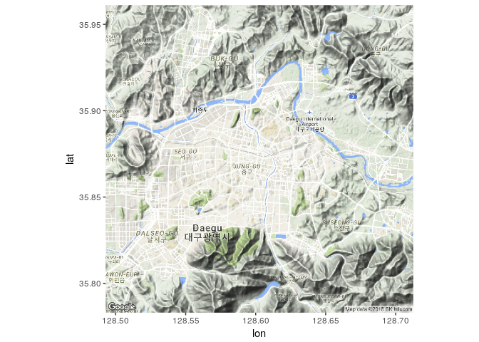

-   `satellite`

``` r
대구지도 <- get_map(c(lon = 128.60250, lat = 35.87222), zoom = 12, maptype="satellite")
```

    ## Map from URL : http://maps.googleapis.com/maps/api/staticmap?center=35.87222,128.6025&zoom=12&size=640x640&scale=2&maptype=satellite&language=en-EN&sensor=false

``` r
ggmap(대구지도)
```


-   `roadmap`

``` r
대구지도 <- get_map(c(lon = 128.60250, lat = 35.87222), zoom = 12, maptype="roadmap")
```

    ## Map from URL : http://maps.googleapis.com/maps/api/staticmap?center=35.87222,128.6025&zoom=12&size=640x640&scale=2&maptype=roadmap&language=en-EN&sensor=false

``` r
ggmap(대구지도)
```

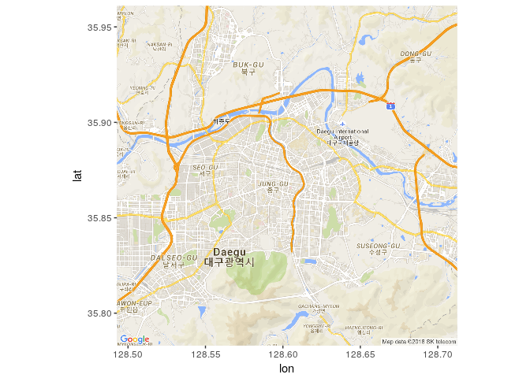

-   `hybrid`

``` r
대구지도 <- get_map(c(lon = 128.60250, lat = 35.87222), zoom = 12, maptype="hybrid")
```

    ## Map from URL : http://maps.googleapis.com/maps/api/staticmap?center=35.87222,128.6025&zoom=12&size=640x640&scale=2&maptype=hybrid&language=en-EN&sensor=false

``` r
ggmap(대구지도)
```

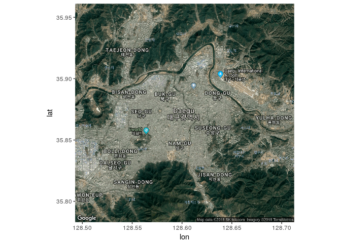

-   `watercolor`

``` r
대구지도 <- get_map(c(lon = 128.60250, lat = 35.87222), zoom = 12, maptype="watercolor")
```

    ## maptype = "watercolor" is only available with source = "stamen".

    ## resetting to source = "stamen"...

    ## Map from URL : http://maps.googleapis.com/maps/api/staticmap?center=35.87222,128.6025&zoom=12&size=640x640&scale=2&maptype=terrain&sensor=false

    ## Map from URL : http://tile.stamen.com/watercolor/12/3509/1608.jpg

    ## Map from URL : http://tile.stamen.com/watercolor/12/3510/1608.jpg

    ## Map from URL : http://tile.stamen.com/watercolor/12/3511/1608.jpg

    ## Map from URL : http://tile.stamen.com/watercolor/12/3512/1608.jpg

    ## Map from URL : http://tile.stamen.com/watercolor/12/3509/1609.jpg

    ## Map from URL : http://tile.stamen.com/watercolor/12/3510/1609.jpg

    ## Map from URL : http://tile.stamen.com/watercolor/12/3511/1609.jpg

    ## Map from URL : http://tile.stamen.com/watercolor/12/3512/1609.jpg

    ## Map from URL : http://tile.stamen.com/watercolor/12/3509/1610.jpg

    ## Map from URL : http://tile.stamen.com/watercolor/12/3510/1610.jpg

    ## Map from URL : http://tile.stamen.com/watercolor/12/3511/1610.jpg

    ## Map from URL : http://tile.stamen.com/watercolor/12/3512/1610.jpg

    ## Map from URL : http://tile.stamen.com/watercolor/12/3509/1611.jpg

    ## Map from URL : http://tile.stamen.com/watercolor/12/3510/1611.jpg

    ## Map from URL : http://tile.stamen.com/watercolor/12/3511/1611.jpg

    ## Map from URL : http://tile.stamen.com/watercolor/12/3512/1611.jpg

``` r
ggmap(대구지도)
```

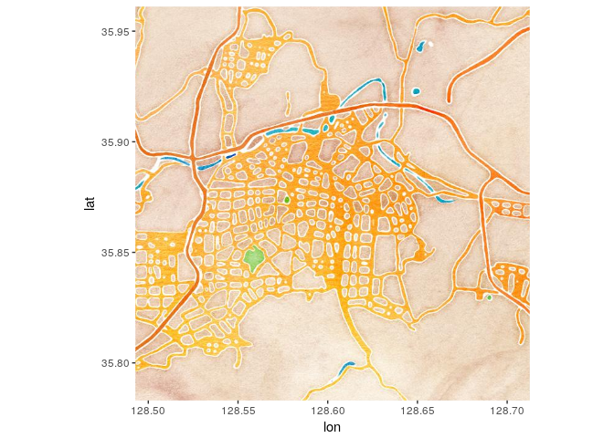

-   `toner-2011`

``` r
대구지도 <- get_map(c(lon = 128.60250, lat = 35.87222), zoom = 12, maptype="toner-2011")
```

    ## maptype = "toner-2011" is only available with source = "stamen".

    ## resetting to source = "stamen"...

    ## Map from URL : http://maps.googleapis.com/maps/api/staticmap?center=35.87222,128.6025&zoom=12&size=640x640&scale=2&maptype=terrain&sensor=false

    ## Map from URL : http://tile.stamen.com/toner-2011/12/3509/1608.png

    ## Map from URL : http://tile.stamen.com/toner-2011/12/3510/1608.png

    ## Map from URL : http://tile.stamen.com/toner-2011/12/3511/1608.png

    ## Map from URL : http://tile.stamen.com/toner-2011/12/3512/1608.png

    ## Map from URL : http://tile.stamen.com/toner-2011/12/3509/1609.png

    ## Map from URL : http://tile.stamen.com/toner-2011/12/3510/1609.png

    ## Map from URL : http://tile.stamen.com/toner-2011/12/3511/1609.png

    ## Map from URL : http://tile.stamen.com/toner-2011/12/3512/1609.png

    ## Map from URL : http://tile.stamen.com/toner-2011/12/3509/1610.png

    ## Map from URL : http://tile.stamen.com/toner-2011/12/3510/1610.png

    ## Map from URL : http://tile.stamen.com/toner-2011/12/3511/1610.png

    ## Map from URL : http://tile.stamen.com/toner-2011/12/3512/1610.png

    ## Map from URL : http://tile.stamen.com/toner-2011/12/3509/1611.png

    ## Map from URL : http://tile.stamen.com/toner-2011/12/3510/1611.png

    ## Map from URL : http://tile.stamen.com/toner-2011/12/3511/1611.png

    ## Map from URL : http://tile.stamen.com/toner-2011/12/3512/1611.png

``` r
ggmap(대구지도)
```

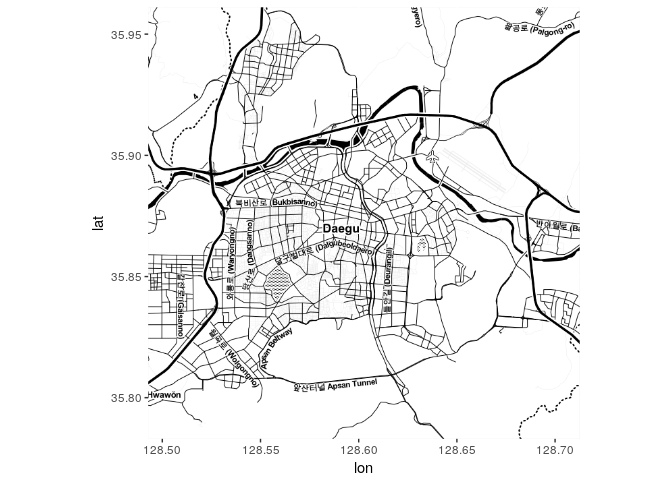

-   `toner-hybrid`

``` r
대구지도 <- get_map(c(lon = 128.60250, lat = 35.87222), zoom = 12, maptype="toner-hybrid")
```

    ## maptype = "toner-hybrid" is only available with source = "stamen".

    ## resetting to source = "stamen"...

    ## Map from URL : http://maps.googleapis.com/maps/api/staticmap?center=35.87222,128.6025&zoom=12&size=640x640&scale=2&maptype=terrain&sensor=false

    ## Map from URL : http://tile.stamen.com/toner-hybrid/12/3509/1608.png

    ## Map from URL : http://tile.stamen.com/toner-hybrid/12/3510/1608.png

    ## Map from URL : http://tile.stamen.com/toner-hybrid/12/3511/1608.png

    ## Map from URL : http://tile.stamen.com/toner-hybrid/12/3512/1608.png

    ## Map from URL : http://tile.stamen.com/toner-hybrid/12/3509/1609.png

    ## Map from URL : http://tile.stamen.com/toner-hybrid/12/3510/1609.png

    ## Map from URL : http://tile.stamen.com/toner-hybrid/12/3511/1609.png

    ## Map from URL : http://tile.stamen.com/toner-hybrid/12/3512/1609.png

    ## Map from URL : http://tile.stamen.com/toner-hybrid/12/3509/1610.png

    ## Map from URL : http://tile.stamen.com/toner-hybrid/12/3510/1610.png

    ## Map from URL : http://tile.stamen.com/toner-hybrid/12/3511/1610.png

    ## Map from URL : http://tile.stamen.com/toner-hybrid/12/3512/1610.png

    ## Map from URL : http://tile.stamen.com/toner-hybrid/12/3509/1611.png

    ## Map from URL : http://tile.stamen.com/toner-hybrid/12/3510/1611.png

    ## Map from URL : http://tile.stamen.com/toner-hybrid/12/3511/1611.png

    ## Map from URL : http://tile.stamen.com/toner-hybrid/12/3512/1611.png

``` r
ggmap(대구지도)
```

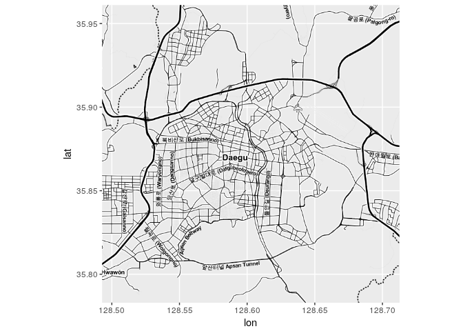

-   `terrain-lines`

``` r
대구지도 <- get_map(c(lon = 128.60250, lat = 35.87222), zoom = 12, maptype="toner-background")
```

    ## maptype = "toner-background" is only available with source = "stamen".

    ## resetting to source = "stamen"...

    ## Map from URL : http://maps.googleapis.com/maps/api/staticmap?center=35.87222,128.6025&zoom=12&size=640x640&scale=2&maptype=terrain&sensor=false

    ## Map from URL : http://tile.stamen.com/toner-background/12/3509/1608.png

    ## Map from URL : http://tile.stamen.com/toner-background/12/3510/1608.png

    ## Map from URL : http://tile.stamen.com/toner-background/12/3511/1608.png

    ## Map from URL : http://tile.stamen.com/toner-background/12/3512/1608.png

    ## Map from URL : http://tile.stamen.com/toner-background/12/3509/1609.png

    ## Map from URL : http://tile.stamen.com/toner-background/12/3510/1609.png

    ## Map from URL : http://tile.stamen.com/toner-background/12/3511/1609.png

    ## Map from URL : http://tile.stamen.com/toner-background/12/3512/1609.png

    ## Map from URL : http://tile.stamen.com/toner-background/12/3509/1610.png

    ## Map from URL : http://tile.stamen.com/toner-background/12/3510/1610.png

    ## Map from URL : http://tile.stamen.com/toner-background/12/3511/1610.png

    ## Map from URL : http://tile.stamen.com/toner-background/12/3512/1610.png

    ## Map from URL : http://tile.stamen.com/toner-background/12/3509/1611.png

    ## Map from URL : http://tile.stamen.com/toner-background/12/3510/1611.png

    ## Map from URL : http://tile.stamen.com/toner-background/12/3511/1611.png

    ## Map from URL : http://tile.stamen.com/toner-background/12/3512/1611.png

``` r
ggmap(대구지도)
```

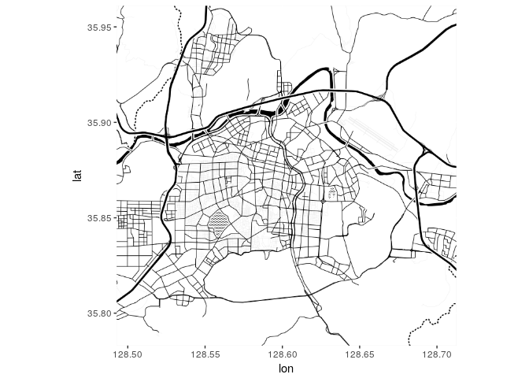

-   `toner-lite`

``` r
대구지도 <- get_map(c(lon = 128.60250, lat = 35.87222), zoom = 12, maptype="toner-lite")
```

    ## maptype = "toner-lite" is only available with source = "stamen".

    ## resetting to source = "stamen"...

    ## Map from URL : http://maps.googleapis.com/maps/api/staticmap?center=35.87222,128.6025&zoom=12&size=640x640&scale=2&maptype=terrain&sensor=false

    ## Map from URL : http://tile.stamen.com/toner-lite/12/3509/1608.png

    ## Map from URL : http://tile.stamen.com/toner-lite/12/3510/1608.png

    ## Map from URL : http://tile.stamen.com/toner-lite/12/3511/1608.png

    ## Map from URL : http://tile.stamen.com/toner-lite/12/3512/1608.png

    ## Map from URL : http://tile.stamen.com/toner-lite/12/3509/1609.png

    ## Map from URL : http://tile.stamen.com/toner-lite/12/3510/1609.png

    ## Map from URL : http://tile.stamen.com/toner-lite/12/3511/1609.png

    ## Map from URL : http://tile.stamen.com/toner-lite/12/3512/1609.png

    ## Map from URL : http://tile.stamen.com/toner-lite/12/3509/1610.png

    ## Map from URL : http://tile.stamen.com/toner-lite/12/3510/1610.png

    ## Map from URL : http://tile.stamen.com/toner-lite/12/3511/1610.png

    ## Map from URL : http://tile.stamen.com/toner-lite/12/3512/1610.png

    ## Map from URL : http://tile.stamen.com/toner-lite/12/3509/1611.png

    ## Map from URL : http://tile.stamen.com/toner-lite/12/3510/1611.png

    ## Map from URL : http://tile.stamen.com/toner-lite/12/3511/1611.png

    ## Map from URL : http://tile.stamen.com/toner-lite/12/3512/1611.png

``` r
ggmap(대구지도)
```

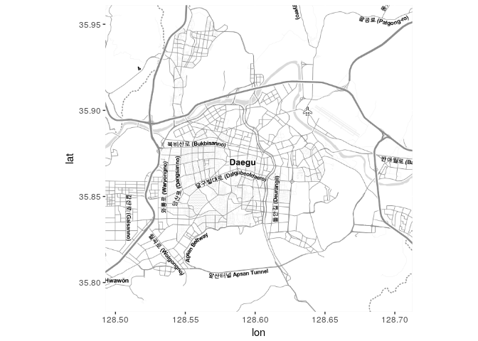

대구 지도에 지하철 역 뿌리기
----------------------------

-   먼저 `$노선명` 정리.

``` r
df_대구메트로역 <- df_대구메트로역 %>%
  mutate(., 노선명 = substr(노선명,9,11))
```

-   전체 지하철역.

``` r
대구지도 <- get_map(c(lon = 128.60250, lat = 35.87222), zoom = 11, maptype="toner-lite")
```

    ## maptype = "toner-lite" is only available with source = "stamen".

    ## resetting to source = "stamen"...

    ## Map from URL : http://maps.googleapis.com/maps/api/staticmap?center=35.87222,128.6025&zoom=11&size=640x640&scale=2&maptype=terrain&sensor=false

    ## Map from URL : http://tile.stamen.com/toner-lite/11/1754/803.png

    ## Map from URL : http://tile.stamen.com/toner-lite/11/1755/803.png

    ## Map from URL : http://tile.stamen.com/toner-lite/11/1756/803.png

    ## Map from URL : http://tile.stamen.com/toner-lite/11/1754/804.png

    ## Map from URL : http://tile.stamen.com/toner-lite/11/1755/804.png

    ## Map from URL : http://tile.stamen.com/toner-lite/11/1756/804.png

    ## Map from URL : http://tile.stamen.com/toner-lite/11/1754/805.png

    ## Map from URL : http://tile.stamen.com/toner-lite/11/1755/805.png

    ## Map from URL : http://tile.stamen.com/toner-lite/11/1756/805.png

    ## Map from URL : http://tile.stamen.com/toner-lite/11/1754/806.png

    ## Map from URL : http://tile.stamen.com/toner-lite/11/1755/806.png

    ## Map from URL : http://tile.stamen.com/toner-lite/11/1756/806.png

``` r
ggmap(대구지도) + geom_point(data=df_대구메트로역, aes(역경도, 역위도, colour = 노선명))
```

    ## Warning: Removed 1 rows containing missing values (geom_point).

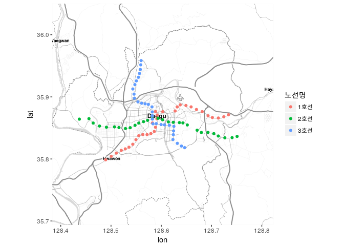

-   zoom 이 너무 작은 값이라 판단돼서 중앙지역만 다시 그림.

``` r
대구지도 <- get_map(c(lon = 128.60250, lat = 35.87222), zoom = 12, maptype="toner-lite")
```

    ## maptype = "toner-lite" is only available with source = "stamen".

    ## resetting to source = "stamen"...

    ## Map from URL : http://maps.googleapis.com/maps/api/staticmap?center=35.87222,128.6025&zoom=12&size=640x640&scale=2&maptype=terrain&sensor=false

    ## Map from URL : http://tile.stamen.com/toner-lite/12/3509/1608.png

    ## Warning in file.remove(index[[url]]): 파일
    ## 'f0ca7e4cfa7e07a8c041ddbc35e59e0d.rds'을 지울 수 없습니다, 그 이유는 '그런
    ## 파일이나 디렉터리가 없습니다'입니다

    ## Map from URL : http://tile.stamen.com/toner-lite/12/3510/1608.png

    ## Warning in file.remove(index[[url]]): 파일
    ## '1c0f109795172283c386be7b00da3362.rds'을 지울 수 없습니다, 그 이유는 '그런
    ## 파일이나 디렉터리가 없습니다'입니다

    ## Map from URL : http://tile.stamen.com/toner-lite/12/3511/1608.png

    ## Warning in file.remove(index[[url]]): 파일
    ## '11eebb89ffce568dd8324d036d1cd420.rds'을 지울 수 없습니다, 그 이유는 '그런
    ## 파일이나 디렉터리가 없습니다'입니다

    ## Map from URL : http://tile.stamen.com/toner-lite/12/3512/1608.png

    ## Warning in file.remove(index[[url]]): 파일
    ## '7b71f9949fe59bffb22ee80d1616c0c9.rds'을 지울 수 없습니다, 그 이유는 '그런
    ## 파일이나 디렉터리가 없습니다'입니다

    ## Map from URL : http://tile.stamen.com/toner-lite/12/3509/1609.png

    ## Warning in file.remove(index[[url]]): 파일
    ## '964e764a92ae5eb54f625b84ad41f237.rds'을 지울 수 없습니다, 그 이유는 '그런
    ## 파일이나 디렉터리가 없습니다'입니다

    ## Map from URL : http://tile.stamen.com/toner-lite/12/3510/1609.png

    ## Warning in file.remove(index[[url]]): 파일
    ## 'a60bdfa815e62ae3fedcd5babda761a9.rds'을 지울 수 없습니다, 그 이유는 '그런
    ## 파일이나 디렉터리가 없습니다'입니다

    ## Map from URL : http://tile.stamen.com/toner-lite/12/3511/1609.png

    ## Warning in file.remove(index[[url]]): 파일
    ## '1468d32e4b01e5655606af0fab880cbc.rds'을 지울 수 없습니다, 그 이유는 '그런
    ## 파일이나 디렉터리가 없습니다'입니다

    ## Map from URL : http://tile.stamen.com/toner-lite/12/3512/1609.png

    ## Warning in file.remove(index[[url]]): 파일
    ## 'd7bcea7346dd98bd6c315f7c944518f2.rds'을 지울 수 없습니다, 그 이유는 '그런
    ## 파일이나 디렉터리가 없습니다'입니다

    ## Map from URL : http://tile.stamen.com/toner-lite/12/3509/1610.png

    ## Warning in file.remove(index[[url]]): 파일
    ## '926d25948751edfd27378d4601d43498.rds'을 지울 수 없습니다, 그 이유는 '그런
    ## 파일이나 디렉터리가 없습니다'입니다

    ## Map from URL : http://tile.stamen.com/toner-lite/12/3510/1610.png

    ## Warning in file.remove(index[[url]]): 파일
    ## 'e3ee1ebade9553839498e78de20851ce.rds'을 지울 수 없습니다, 그 이유는 '그런
    ## 파일이나 디렉터리가 없습니다'입니다

    ## Map from URL : http://tile.stamen.com/toner-lite/12/3511/1610.png

    ## Warning in file.remove(index[[url]]): 파일
    ## 'd84a83eee1abc4d207047d5b0ecc71bc.rds'을 지울 수 없습니다, 그 이유는 '그런
    ## 파일이나 디렉터리가 없습니다'입니다

    ## Map from URL : http://tile.stamen.com/toner-lite/12/3512/1610.png

    ## Warning in file.remove(index[[url]]): 파일
    ## '612dae038b5432fd0d4f320629f02564.rds'을 지울 수 없습니다, 그 이유는 '그런
    ## 파일이나 디렉터리가 없습니다'입니다

    ## Map from URL : http://tile.stamen.com/toner-lite/12/3509/1611.png

    ## Warning in file.remove(index[[url]]): 파일
    ## '13afc4847f4c46ce66cca7361463b00a.rds'을 지울 수 없습니다, 그 이유는 '그런
    ## 파일이나 디렉터리가 없습니다'입니다

    ## Map from URL : http://tile.stamen.com/toner-lite/12/3510/1611.png

    ## Warning in file.remove(index[[url]]): 파일
    ## '30f2536120423e2d60b90192ecbafd8e.rds'을 지울 수 없습니다, 그 이유는 '그런
    ## 파일이나 디렉터리가 없습니다'입니다

    ## Map from URL : http://tile.stamen.com/toner-lite/12/3511/1611.png

    ## Warning in file.remove(index[[url]]): 파일
    ## '60144f5745f8211561edf487dcdbf288.rds'을 지울 수 없습니다, 그 이유는 '그런
    ## 파일이나 디렉터리가 없습니다'입니다

    ## Map from URL : http://tile.stamen.com/toner-lite/12/3512/1611.png

    ## Warning in file.remove(index[[url]]): 파일
    ## '0602c1bfe73eb5afca6a3111ab228d0d.rds'을 지울 수 없습니다, 그 이유는 '그런
    ## 파일이나 디렉터리가 없습니다'입니다

``` r
ggmap(대구지도) + geom_point(data=df_대구메트로역, aes(역경도, 역위도, colour = 노선명))
```

    ## Warning: Removed 14 rows containing missing values (geom_point).

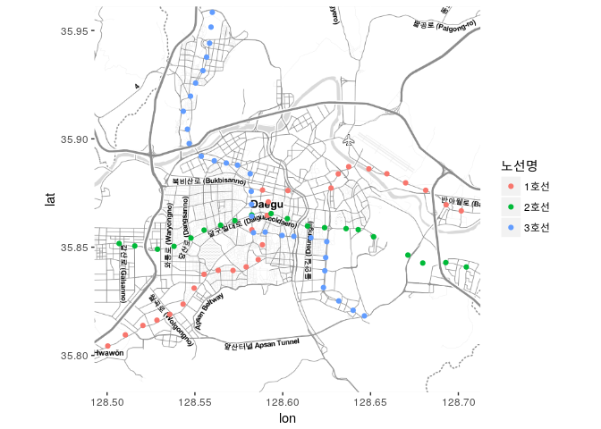

2017년 12월 24일 오후 6시에서 7시 이용현황
------------------------------------------

-   데이터 전처리
    -   `$월` == 12 , `$일` == 25 , `$시간` == 18-19 만 가져와야함.

``` r
temp_df <- df_merged %>%
  filter(., (월 == 12) & 일 == 25 & 시간 == "18-19")
```

-   승차인원만.

``` r
ggmap(대구지도) + geom_point(data=temp_df %>% filter(., 승하 == "승차") , aes(역경도, 역위도, colour = 노선명, size = 인원), alpha = 0.75)
```

    ## Warning: Removed 14 rows containing missing values (geom_point).

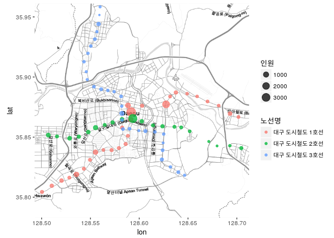

-   하차인원만.

``` r
ggmap(대구지도) + geom_point(data=temp_df %>% filter(., 승하 == "하차") , aes(역경도, 역위도, colour = 노선명, size = 인원), alpha = 0.75)
```

    ## Warning: Removed 14 rows containing missing values (geom_point).

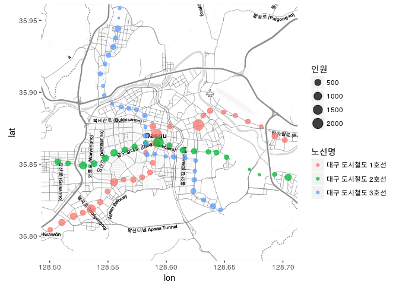

정리, 반성 및 Future work
=========================

-   그림을 그리고 보니, 특히나 좀 많이 겹치는 점이 있어서 생각해보니, 환승역인 경우는 같은 역을 찾아서 이용객 수를 합쳐야 하지 않았나 싶다. (이 경우 환승역의 색도 다르게 줘야한다. 데이터 자체에 환승역에 대한 정보가 있었던 듯 하다. 다시 전처리 해보자.)

-   역이 너무 조밀하게 있어서 구/군별로 나눠서 표시하는 것이 나을지도 모른다는 생각이 든다. 구/군별로 그 크기가 너무 많이 다르기 때문에 그려봐야만 옳은지 그른지 판단할 수 있는 문제일지도 모른다. (구/군에 대한 공간정보를 포함한 새로운 데이터가 필요하다.)

-   상차인원과 하차인원을 나누면 유동인구의 움직임을 볼 수 있지 않을까 했는데 생각보다 뚜렷하게 보이지는 않는다. (12월 25일이 특수한 경우라서 그럴지도 모른다.)

-   shinyR을 쓰면 상호작용하는 앱을 만들수도 있겠다.

-   ggplotly를 쓰면 시각적으로 더 멋있는 결과를 얻을지도 모르겠다. 공부해야봐야겠다.

-   딱히 통계적인 요소가 들어간 것이 없는 듯 하다. 이 데이터로 사람들의 의사결정에 도움을 줄 수 있을만한 시각화를 할 수 있을까? 더 고민해봐야겠다.
